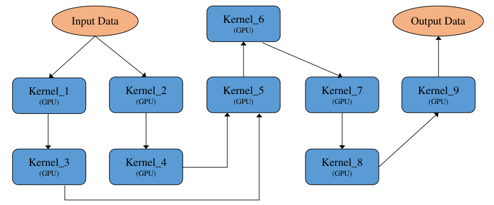
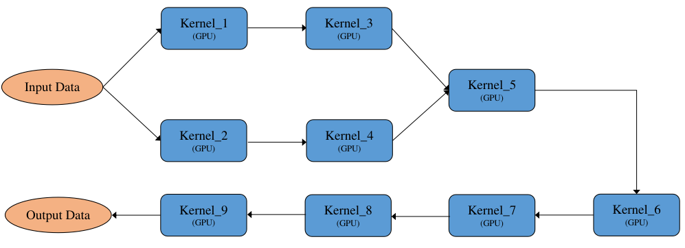
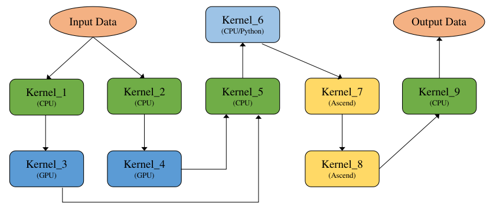
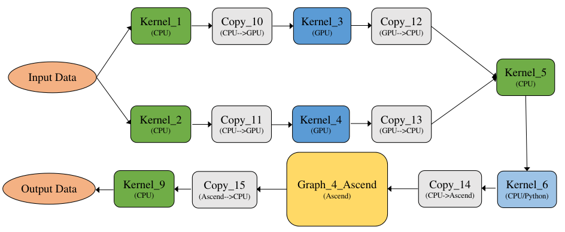

## 计算调度与执行

经过算子选择与内存分配之后，计算任务可以通过运行时完成计算的调度与在硬件上的执行。根据是否将算子编译为计算图，计算的调度可以分为单算子调度与计算图调度两种方式，例如在MindSpore中分别提供了PyNative模式和Graph模式。而根据硬件提供的能力差异，计算图的执行方式又可以分为逐算子下发执行的交互式执行以及将整个计算图或者部分子图一次性下发到硬件的下沉式执行两种模式。

### 单算子调度

单算子调度是相对于计算图而言，算法或者模型中包含的算子通过Python语言的运行时被逐个调度执行。例如PyTorch的默认执行方式，TensorFlow的eager模式，以及MindSpore的PyNative模式。以如下MindSpore示例代码所示：

```python
    import mindspore.nn as nn
    from mindspore import context
    from mindspore import ms_function

    # 以单算子方式执行后续计算中的算子。
    context.set_context(mode=context.PYNATIVE_MODE)

    class Computation(nn.Cell):
        def construct(self, x, y):
            m = x * y
            n = x - y
            print(m)
            z = m + n
            return z

    compute = Computation()
    c = compute(1, 2)
    print(c)
```

上述脚本将所有的计算逻辑定义在Computation类的construct方法中，由于在脚本开头的context中预先设置了单算子执行模式，construct中的计算将被Python的运行时逐行调用执行，同时可以在代码中的任意位置添加print命令以便打印中间的计算结果。

单算子执行的调用链路如图:numref:`single_op_exec`所示，算子在Python侧被触发执行后，会经过AI框架初始化，其中需要确定包括算子的精度，输入与输出的类型和大小以及对应的硬件设备等信息，接着框架会为该算子分配计算所需的内存，最后交给具体的硬件计算设备完成计算的执行。


:width:`800px`
:label:`single_op_exec`

单算子调度方式的好处在于其灵活性，由于算子直接通过Python运行时调度，一方面可以表达任意复杂的计算逻辑，尤其是在需要复杂控制流以及需要Python原生数据结构支持来实现复杂算法的场景；另一方面单算子调度对于程序正确性的调试非常便利，开发人员可以在代码执行过程中打印任意需要调试的变量；最后一点是通过Python运行时驱动算子的方式，可以在计算中与Python庞大而丰富的生态库协同完成计算任务。

### 计算图调度

虽然单算子调度具有如上所述的优点，其缺点也很明显。一方面是难于进行计算性能的优化，原因是由于缺乏计算图的全局信息，单算子执行时无法根据上下文完成算子融合，代数化简等优化；另一方面由于缺乏计算的拓扑关系，整个计算只能串行调度执行，即无法通过运行时完成并行计算。例如上述示例代码的计算逻辑可以表达为图:numref:`graph_exec`所示。由该计算图可以看出，其中乘法和减法之间并没有依赖关系，因此这两个计算可以并行执行，而这样的并行执行信息只有将计算表达为计算图后才能完成分析，这也是计算图调度相对于单算子调度的优势之一。


:width:`800px`
:label:`graph_exec`

下面我们开始介绍计算图的调度方式，在一个典型的异构计算环境中，主要存在CPU、GPU以及NPU等多种计算设备，因此一张计算图可以由运行在不同设备上的算子组成为异构计算图。图:numref:`computation_graph`展示了一个典型的由异构硬件共同参与的计算图。


:width:`800px`
:label:`computation_graph`

所述计算图由如下几类异构硬件对应的算子组成：

-   **CPU算子**：由C++语言编写实现并在主机上通过CPU执行的算子，CPU计算的性能取决于是否能够充分利用CPU多核心的计算能力。

-   **GPU算子**：以英伟达GPU芯片为例，通过在主机侧将GPU
    Kernel逐个下发到GPU设备上，由GPU芯片执行算子的计算逻辑，由于芯片上具备大量的并行执行单元，可以为高度并行的算法提供强大的加速能力。

-   **NPU算子**：以华为Ascend芯片为例,
    Ascend是一个高度集成的SoC芯片，NPU的优势是支持将部分或整个计算图下沉到芯片中完成计算，计算过程中不与Host发生交互，因此具备较高的计算性能。

-   **Python算子**：在执行模式上与CPU算子类似，都是由主机上的CPU执行计算，区别在于计算逻辑是由Python语言的运行时通过Python解释器解释执行。

异构计算图能够被正确表达的首要条件是准确标识算子执行所在的设备，例如异构计算图:numref:`computation_graph`中所标识的CPU、GPU和Ascend
Kernel，以及被标记为被Python语言运行时执行的Python
Kernel。主流框架均提供了指定算子所在运行设备的能力，以MindSpore为例，一段简单的异构计算代码如下所示：

```python
    import numpy as np
    from mindspore import Tensor
    import mindspore.ops.operations as ops
    from mindspore.common.api import ms_function

    # 创建算子并指定执行算子的硬件设备
    add = ops.Add().add_prim_attr('primitive_target', 'CPU')
    sub = ops.Sub().add_prim_attr('primitive_target', 'GPU')

    # 指定按照静态计算图模式执行函数
    @ms_function
    def compute(x, y, z):
        r = add(x, y)
        return sub(r, z)

    # 创建实参
    x = Tensor(np.ones([2, 2]).astype(np.float32))
    y = Tensor(np.ones([2, 2]).astype(np.float32))
    z = Tensor(np.ones([2, 2]).astype(np.float32))

    # 执行计算
    output = compute(x, y, z)
```

上述代码片段完成了x + y -
z的计算逻辑，其中Add算子被设置为在CPU上执行，Sub算子被设置为在GPU上执行，从而形成了CPU与GPU协同的异构计算，通过类似的标签机制，可以实现任意复杂的多硬件协同的异构计算表达。
另外一类较为特殊的异构是Python算子，Python语言的优势在于表达的灵活性和开发效率，以及丰富的周边生态，因此将Python算子引入到计算图中和其它异构硬件的算子协同计算，对计算的灵活性会产生非常大的帮助。与CPU、GPU分别执行在不同设备上的异构不同，Python算子和C++实现的CPU算子都是通过主机侧的CPU核执行，差异在于Python算子是通过统一的计算图进行描述，因此也需要在计算图的执行引擎中被触发执行。为了在计算图中能够表达Python算子，框架需要提供相应的支持。

完成计算图中算子对应设备的标记以后，计算图已经准备好被调度与执行，根据硬件能力的差异，可以将异构计算图的执行分为三种模式，分别是逐算子交互式执行，整图下沉执行与子图下沉执行。交互式执行主要针对CPU和GPU的场景，计算图中的算子按照输入和输出的依赖关系被逐个调度与执行；而整图下沉执行模式主要是针对NPU芯片而言，这类芯片主要的优势是能够将整个神经网络的计算图一次性下发到设备上，无需借助主机的CPU能力而独立完成计算图中所有算子的调度与执行，减少了主机和芯片的交互次数，借助NPU的Tensor加速能力，提高了计算效率和性能；子图下沉执行模式是前面两种执行模式的结合，由于计算图自身表达的灵活性，对于复杂场景的计算图在NPU芯片上进行整图下沉执行的效率不一定能达到最优，因此可以将对于NPU芯片执行效率低下的部分分离出来，交给CPU或者GPU等执行效率更高的设备处理，而将部分更适合NPU计算的子图下沉到NPU进行计算，这样可以兼顾性能和灵活性两方面。

上述异构计算图可以实现两个目的，一个是异构硬件加速，将特定的计算放置到合适的硬件上执行；第二个是实现算子间的并发执行，从计算图上可以看出，kernel_1和kernel_2之间没有依赖关系，kernel_3和kernel_4之间也没有依赖关系，因此这两组CPU和GPU算子在逻辑上可以被框架并发调用，而kernel_5依赖kernel_3和kernel_4的输出作为输入，因此kernel_5需要等待kernel_3和kernel_4执行完成后再被触发执行。

虽然在计算图上可以充分表达算子间的并发关系，在实际代码中会产生由于并发而引起的一些不预期的副作用场景，例如如下代码所示：

```python
    import mindspore as ms
    from mindspore import Parameter, Tensor
    import mindspore.ops.operations as ops
    from mindspore.common.api import ms_function

    # 定义全局变量
    x = Parameter(Tensor([1.0], ms.float32), name="x")
    y = Tensor([0.2], ms.float32)
    z = Tensor([0.3], ms.float32)

    # 指定按照静态计算图模式执行函数
    @ms_function
    def compute(y, z):
        ops.Assign()(x, y)
        ops.Assign()(x, z)
        r = ops.Sub()(x, y)
        return r

    compute(y, z)
```

上述代码表达了如下计算逻辑：

```text
    x = y
    x = z
    x = x - y
```

这段简单的计算逻辑翻译到计算图上可以表示为：


:width:`800px`
:label:`side_effect_1`

代码中所示三行计算之间并没有依赖关系，因此这三个算子在计算图的逻辑上可以被并发执行，并发关系如图:numref:`side_effect_1`所示，然而根据代码的语义，显而易见是需要确保程序能够被顺序执行，这里引入的问题被称为副作用，副作用是指函数修改了在函数外部定义的状态变量的行为。由于副作用的引入而导致了错误并发关系的发生，一种解决方案是在计算图编译阶段通过添加算子间的依赖，将并发执行逻辑转换为顺序执行逻辑，转换后的计算图如图:numref:`side_effect_2`所示：


:width:`800px`
:label:`side_effect_2`


图中虚线箭头表达了算子之间的依赖关系，添加依赖关系后，算子会按照Assign_1，Assign_2，Sub_1的顺序串行执行，与代码原本的语义保持一致。

### 交互式执行

如上所述，交互式执行模式下，框架的运行时根据计算图中算子的依赖关系，按照某种执行序（例如广度优先序）逐个将算子下发到硬件上执行。为了助于理解和对比，先引入非异构计算图（计算图中的算子都是在同一类设备上）的执行方式，异构计算图的执行是基于非异构计算图基础之上的。

1、非异构计算图的执行方式


:width:`800px`
:label:`graph_exec_1`

如图:numref:`graph_exec_1`是一张非异构计算图，计算图上全部Kernel均为GPU算子，执行方式一般分为串行执行和并行执行：


:width:`800px`
:label:`graph_exec_2`


:width:`800px`
:label:`graph_exec_3`

-   **串行执行**：将计算图展开为执行序列，按照执行序逐个串行执行，如图:numref:`graph_exec_2`所示。其特点为执行顺序固定，单线程执行，对系统资源要求相对较低。

-   **并行执行**：将计算图按照算子之间的依赖关系展开，有依赖关系的算子通过输入依赖保证执行顺序，没有依赖关系的算子则可以并行执行，如图:numref:`graph_exec_3`所示，Kernel_1和Kernel_2没有依赖可以并行执行，Kernel_3和Kernel_4没有依赖可以并行执行。其特点为执行顺序不固定，每轮执行的算子顺序大概率不一样，多线程执行，对系统资源要求相关较高。

串行执行和并行执行各有优点和缺点，总结对比见表5.1。


   | 执行方式     | 串行执行 |  并行执行 |
   |--------------|----------|------|
   |算子执行顺序    | 固定  |    不固定 |
   |算子执行线程    |单线程  |   多线程 |
   |所需执行资源    | 较低  |     较高 |

2、异构计算图的执行方式


:width:`800px`
:label:`graph_exec_4`

如图:numref:`graph_exec_4`是一张异构计算图，其中Kernel_1、Kernel_2、Kernel_5、Kernel_9为CPU算子，Kernel_6为python算子（执行也是在CPU上），Kernel_3和Kernel_4为GPU算子，Kernel_7和Kernel_8为GPU算子。
一般来说计算图的优化都是基于非异构计算图来实现的，要求计算图中的算子为同一设备上的，方便算子间的融合替换等优化操作，因此需要将一张异构计算图切分为多个非异构计算图，这里切分就比较灵活了，可以定义各种切分规则，一般按照产生尽量少的子图的切分规则来切分，尽量将多的同一设备上的算子放在一张子图中，如图:numref:`graph_exec_5`所示，最后产生5张子图：Graph_1\_CPU、Graph_2\_GPU、Graph_3\_CPU、Graph_4\_Ascend、Graph_5\_CPU。


:width:`800px`
:label:`graph_exec_5`

将一张异构计算图切分为多个子计算图后，执行方式一般分为子图拆分执行和子图合并执行：

-   **子图拆分执行**：将切分后的多个子图分开执行，即一个子图执行完再执行另一个子图，如图:numref:`graph_exec_6`所示，上一个子图的输出数据会传输给下一个子图的输入数据，并且下一个子图需要对输入数据拷贝为本图的device数据，如Graph_2\_GPU需要将Graph_1\_CPU的输出数据从CPU拷贝到GPU，反过来Graph_3\_CPU需要将Graph2GPU的输出数据从GPU拷贝到CPU，子图之间互相切换执行有一定的开销。

-   **子图合并执行**：将切分后的多个子图进行合并，合并为一个整体大的DAG执行，如图:numref:`graph_exec_7`所示，通过算子的设备属性来插入拷贝算子以实现不同设备上的算子数据传输，并且拷贝算子也是进入整图中的，从而形成一个大的整图执行，减少子图之间的切换执行开销。


:width:`800px`
:label:`graph_exec_6`


:width:`800px`
:label:`graph_exec_7`

由于子图合并执行能够减少子图之间的切换执行开销，因此一般来说子图合并执行性能较高，总结对比见表5.2。

|     执行方式      |   子图拆分   |      子图合并|
|  --------------|------------------|--------------|
|   异构数据传输  |   子图之间拷贝  |   算子之间拷贝|
|   执行额外开销  | 子图切换执行开销 |       无|
|   执行并发粒度  |     子图并发    |   算子原生并发|


3、异构计算图的执行加速

前面讲述了非异构计算图的两种执行方式和异构计算图的两种执行方式，其中异构计算图又是在非异构计算图的基础之上，因此异构计算图按照两两组合共有四种执行方式，以MindSpore为例，采用的是子图合并并行执行，示例图如图:numref:`graph_exec_5`所示，首先是作为一张整图来执行可以避免子图切换的执行开销，然后在整图内并行执行，可以最大粒度的发挥并发执行优势，达到最优的执行性能。


:width:`800px`
:label:`graph_exec_8`

### 下沉式执行

下沉式执行是通过专用芯片的SoC架构，将整个或部分计算图一次性调度到芯片上以完成全量数据的计算。例如对于Ascend芯片，多个Ascend算子组成的计算图可以在执行前被编译成为一个Task，通过Ascend驱动程序提供的接口，将包含多个算子的Task一次性下发到硬件上调度执行。因此上例中可以将Ascend的算子Kernel_7和Kernel_8优化为一个子图Graph_4\_Ascend，再将该子图编译成为一个Task，并下沉到Ascend上执行，如图:numref:`graph_exec_8`所示。

下沉式执行由于避免了在计算过程中主机侧和设备侧的交互，因此可以获得更好的整体计算性能。然而下沉式执行也存在一些局限，例如在动态shape算子，复杂控制流等场景下会面临较大的技术挑战。